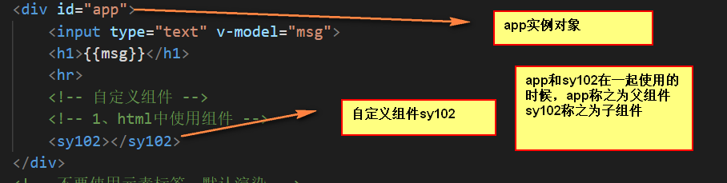
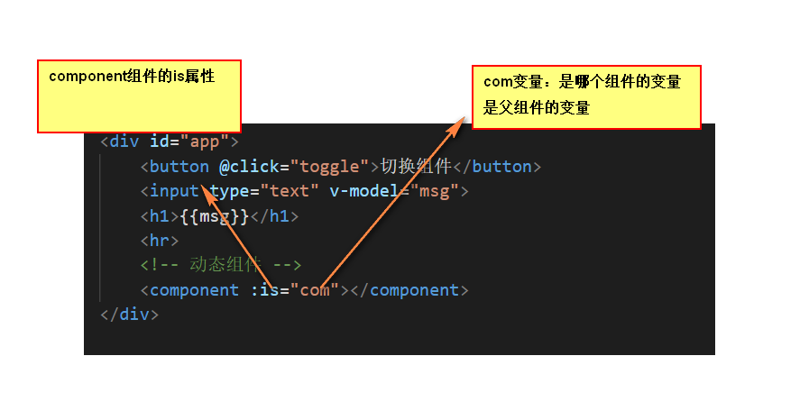
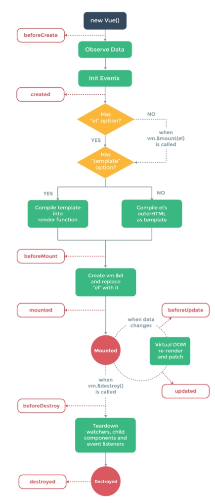
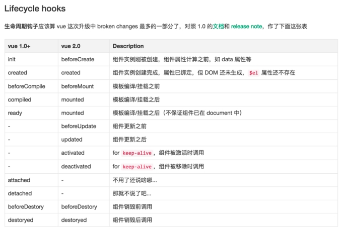
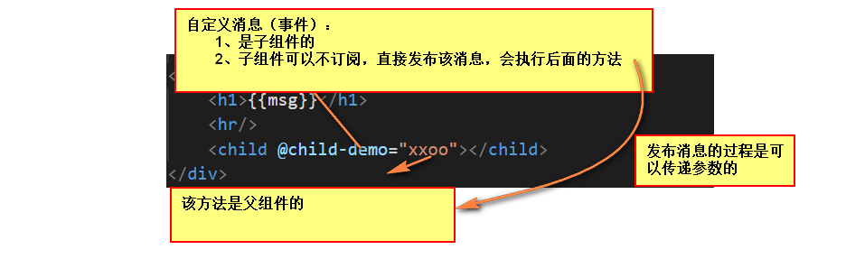

# 复习

1、事件绑定指令

```
格式：v-on:click="fn()"
语法糖：@click
参数问题：
	1、没有参数传入事件对象
	2、有参数则使用参数
	3、$event
```

2、定义处理程序

```
methods
```

3、修饰符

@click.修饰符("fn"）， 修饰事件的

- 通用修饰符

```
stop
prevent
once
self
```

- 鼠标

```
left
right
middle
```

- 键盘

```
所有按键均可
注意： delete 对应键盘上两个键
```

4、绑定类

```
:class={key:boolean}
:class=[className1, className2]
:class="style"
```

5、绑定样式

```
:style={styleName: styleValue}
:style=[{styleName: styleValue},{styleName: styleValue}]
:style="style"
```

6、指令

```
v-if
v-else-if
v-else
v-show
记住： v-if 和 v-show
v-for
	v-for="value in data"
	v-for="(value, index) in data"
```

7、模板元素

```
<script type="text/template"></script>
<template></template>
```

8、过渡（修饰单个元素）

```
transition
通过设置name（bm）属性，可以在css中监听到对应的状态变化

css中
1、从隐藏到显示 enter
	.bm-enter
	.bm-enter-to
	.bm-enter-active
2、从显示到隐藏 leave
	.bm-leave
	.bm-leave-to
	.bm-leave-active

初次渲染的时候执行动画，appear
mode: 默认是同时进行
	in-out
	out-in
```

9、列表过渡

```
transition-group
```


# 一、Vue

## 1.1自定义指令

指令：**指令是对DOM元素的拓展，使其具有一定的行为特征（功能）**

已经学过的指令：

```
v-bind, v-html, v-text, v-once, v-model, v-cloak, v-on, v-if, v-else-if, v-else, v-show, v-for......
```

但是内置的指令是有限的，因此为了拓展更多的功能，我们要自定义指令。

### 1.1.1使用指令

> 使用自定义指令需要两步:

- 第一步 在模板中，使用指令

  ```
  命名规范：以v-为前缀，指令名称字母小写，横线分割单词。
  指令属性值是js环境。
  ```

- 第二步 在js中定义自定义指令，跟过滤器一样，有两种方式：

  ```
  第一种 全局定义：Vue.directive(name, fn | {}) ，可以在任何组件中使用。
  第二种 局部定义：directives: { name; fn | {} }，只能在当前的组件中使用。
  name表示指令名称，将v-前缀删除，使用驼峰式命名: 例如 v-bm-html 名称为:bmHtml
  {} 表示指令对象，为指令定义功能方法。
  	bind：绑定指令的时候执行的方法
  	update:指令更新的时候执行的方法
  	unbind:指令解除绑定的时候执行的方法
  	2.0中拓展两个方法
  		inserted:指令所在的元素插入到页面中执行的方法
  		componentUpdated:指令所在的组件更新的时候执行的方法
  ```

**fn 代表指令函数，如果指令对象中的这些方法都是相同的，我们可以用指令函数代替它们**

不论是指令函数还是指令对象中的方法。都有四个参数

- 第一个参数表示指令所在的DOM元素

- 第二个参数表示指令对象

  ```
  包含指令相关的属性：指令名称，指令表达式，当前的值，上一个值等等。
  ```

- 第三个参数表示当前的虚拟DOM

- 第四个参数表示上一个虚拟DOM

**注意：**

如果全局定义指令，一定要在vue实例化对象之前定义的指令,指令方法directive不能解构。

当多次使用同一个指令的时候，**一个指令的属性值更新，所有指令方法都会执行。**

我们可以对比当前指令值与上一个指令值是否不等，不相等再执行指令内部的逻辑。

### 1.1.2实现指令

参考vue内置的指令：v-html，v-once，v-show

实现以下指令：

```
v-bm-html
v-bm-once
v-bm-show
```

## 1.2组件

html中有组件：就是一段可以被复用的代码

css中有组件：就是一段可以被复用的样式

js中有组件：就是一段可以被复用的功能。

vue中有组件：就是一段包含模板，样式和脚本的可以被复用的完整体。

### 1.2.1使用组件

> 使用组件分成三步:

- 第一步 定义组件（在html中进行使用）

  ```
  组件就是一个自定义元素，
  命名规范：字母小写（字母不区分大小写），横线分割单词
  ```

- 第二步 定义组件类

  ```
  通过Vue.extend方法定义组件，参数和vue实例化时候传递的参数是一样的。
  computed	定义计算属性数据
  watch 		定义数据监听器
  methods 	定义方法
  ...
  有几个属性是特殊
  	data：定义静态数据。是一个函数。返回值才是数据。没有参数，this指向组件。由于数据在返回值中绑定，因此在函数体中，我们只能访问实例化对象，无法访问绑定的数据。
  	template:定义模板，有两种用法
  		第一种:直接定义模板字符串。
  		第二种:属性值是css选择器。
  		此时会根据选择器获取元素的内容，作为组件的模板
  		在html中定义模板有两种方式：
  			通过script模板标签定义
  			通过template模板元素定义
  			vue建议我们使用template模板元素.
  			注意：模板中，最外层有且只有一个根元素
  组件继承了Vue类，因此组件也可以看成是vue实例化对象，反过来，vue实例化对象也可以看成是组件，后面统称成组件
  ```

- 第三步 注册组件

  ```
  有两种注册方式
  	第一种 全局注册：Vue.component(name, Comp),全局注册的组件在任何组件中都可以使用
  	第二种 局部注册：components: { name: Comp },局部注册的组件只能在当前组件中使用。
  		name代表组件名称，驼峰式命名（字母不区分大小写）
  		Comp代表组件类。
  组件是一个完整独立的个体，彼此之间数据不会共享
  
  ```

### 1.2.2父组件与子组件

我们在vue实例化对象中使用组件。这个vue实例化对象可以看成是父组件,内部使用的组件可以看成是子组件。



## 1.3动态组件

一个自定义元素只能渲染一类组件，想让一个元素渲染多个组件，vue提供了动态组件技术：

通过component元素定义,通过is属性来指明渲染的元素。

属性值默认是字符串，通过v-bind指令可以动态设置。



## 1.4组件生命周期

vue为了说明组件创建，存在，销毁的过程，为组件提供了生命周期技术。

**共分三大周期：创建期，存在期，销毁期**

> 创建期：用来描述组件创建的过程的。

共分四个阶段

```
beforeCreate 		组件创建前，此时组件数据，事件等还没有被初始化。

created 			组件创建后，此时组件已经初始化了数据和事件等。

beforeMount 		组件构建前，此时组件确定了模板和容器元素。

mouted 				组件构建后，此时组件已经上树。
```

由于组件一生中只能被创建一次，所以创建期的方法只能执行一次。

> 存在期：用来描述组件是如何更新的。当组件中的数据发生改变，组件将进入存在期

共分两个阶段

```
beforeUpdate		组件更新前，此时组件的数据已经更新，但是视图尚未更新

updated				组件更新后，此时组件的视图已经更新。
```

一次数据更新的结束，并不代表组件存在期的结果，存在期仍然继续。

组件一生中，数据会经常更新，因此会始终处在存在期。

直到组件从页面中删除（或者调用$destroy方法）组件将进入销毁期。

> 销毁期：用来说明组件如何被销毁的。

共分两个阶段

```
beforeDestroy		组件销毁前，此时组件数据，事件等依然存在

destroyed			组件销毁后，此时数据监听器等已经被销毁了、
```

一旦组件被销毁，就再也无法访问组件，只能重新创建一个新组件了。

## 1.5 keep-alive

组件从页面中删除，组件将进入销毁期。如果不想进入销毁期，可以使用keep-alive组件。

我们在组件的外部包裹keep-alive组件，该自定义组件将不会被销毁。而是缓存在内存中、当我们下次在使用组件的时候，将从内存中提取该缓存的组件.

**缓存的是组件最后一个状态，因此组件再次出现的时候，显示的就是最后一个状态。**

由于此时无法执行销毁期的周期方法，因此keep-alive组件为自定义组件拓展了两个方法：

activated			组件被激活（出现了）

deactivated		组件被禁用（隐藏了）

 

 

 

## 1.6组件通信

组件通信就是在组件之间共享数据，通常有三个方向：

父组件向子组件通信，

子组件向父组件通信，

兄弟组件之间的通信

### 1.6.1父组件向子组件通信

父组件向子组件通信，就是说将父组件中的数据传递给子组件。

> 实现通信分成两步

- 第一步 在父组件模板中，为子组件元素传递属性数据。


```
属性名称：字母小写横线分割单词。

属性值默认是字符串，变成js环境用v-bind指令。
```

- 第二步 在子组件中，接收属性数据，


```
通过props属性接收，有两种接收方式

第一种: 属性值是数组，每一个成员代表一个属性数据

驼峰式命名

第二种：属性值是对象

key 	表示属性名称（驼峰式命名）

value 	约束数据，有三种情况

值是类型的构造函数，如 Number, String ......

值是数组，每一个成员是一个类型的构造函数 [Number, String]

值是对象，对数据做更多的约束

type 		定义数据类型

default 	定义默认数据

	可以是数据
	可以是函数，函数的返回值就是默认值

required 	是否是必填的。

validator 		校验方法

返回值表示判断的结果。
```

**注意：接收的数据跟模型中的数据一样，添加给vue实例化对象自身，并设置了特性，所以既可以在模板中使用，也可以在js中使用。**

### 1.6.2 $parent

在组件实例化对象中，存在一个$parent属性，代表父组件，因此我们可以通过$parent属性访问父组件中的数据。

由于这种方式产生了耦合问题，所以工作中，不常用，

工作中，我们常常使用传递属性的方式通信。

### **1.6.3自定义事件**

vue参考了观察者模式，实现了订阅消息，发布消息，注销消息等方法，组件都继承了这些方法。

$on(type, fn)			订阅消息

type 					消息名称

fn 						回调函数

$off(type, fn)			注销消息

type 					消息名称

fn 						回调函数

$emit(type, ...arg)	发布消息

type					消息名称

arg 					从第二个参数开始表示传递的数据。

注意：组件是一个完整独立的个体，因此彼此之间数据，消息不会共享，

因此一个组件注册的消息，只能由当前组件发布，其它的组件无法发布。

我们可以在父组件中注册消息，在子组件中，通过this.$parent方法父组件，在发布消息，并传递数据，进而实现子组件向父组件通信，

由于访问了$parent，所以有耦合的问题。

```
1、在父组件创建完毕，created，添加自定义事件xxoo
2、子组件创建完毕，使用 this.$parent.$emit('xxoo', 传递的参数)
等价于在子组件创建完毕执行
	this.$parent.msg = 'i love you';
```

```js
// 引入Vue
import Vue from 'vue';
// 声明一个组件
const child = Vue.extend({
    // 模板
    template: `
        <div>
            <h1>child part</h1>
            <h2>{{msg}}</h2>
        </div>
    `,
    // 模型
    data() {
        return {
            msg: 'child component'
        }
    },
    // 创建完毕
    created() {
        // 父组件向子组件传递消息有两种方式，1 属性---props 2 $parent 强耦合
        // 1、利用这个parents属性直接给父组件进行赋值
        // this.$parent.msg = 'i love you';

        // 2、利用事件的触发
        this.$parent.$emit('demo', this.msg);
    },
});
// 实例化对象
const app = new Vue({
    // 视图
    el: '#app',
    // 模型
    data: {
        msg: 'hello'
    },
    // 注册子组件
    components: {child},
    // 创建完毕
    created() {
        console.log(this);

        // 订阅一个消息
        this.$on('demo', (msg, ...args) => {
            console.log('$on', args);
            this.msg = msg;
        })
    },
})
```


### 1.6.4子组件向父组件通信

子组件向父组件通信有两种方式

第一种：模拟DOM事件

```
1、在子组件中创建自定义事件，处理程序为父元素的methods
2、子组件创建完毕之后，自动触发自定义事件，传递对应的参数
3、在父元素的methods中接收数据处理结果
4、要求在调用父组件的methods不能传递参数
```

第二种：传递方法。

#### 1.6.4.1模拟DOM事件

在vue中绑定DOM事件：

v-on:click=”fn”

模拟DOM事件

v-on:demo=”fn”

> 实现通信分成四步

第一步 在父组件模板中，为子组件绑定DOM事件

事件名称字母小写，横线分割单词

注意：事件回调函数不要添加参数集合

如果没有添加参数集合，可以接收所有的数据

如果添加了参数集合，默认无法接收数据，即使传递了$event也只能接收一个数据，其它的数据丢失。

第二步 在父组件中，定义事件回调函数

第三步 在子组件中，发布消息，传递子组件中的数据。

消息名称要与绑定的自定义消息名称一致（字母小写，横线分割单词）

注意：不要转化成驼峰式命名，这是唯一一处不需要转驼峰式命名的地方。

第四步 父组件接收数据，存储数据，更新视图。

<b style="color:red;">注意： 事件谁绑定的，谁触发，组件之间的数据不共享，自定义事件也不共享</b>

 

```js
// 引入Vue
import Vue from 'vue';

// 声明一个组件
const child = Vue.extend({
    // 模板
    template: `
        <div>
            <h1>child part</h1>
            <h2>{{msg}}</h2>
        </div>
    `,
    // 模型
    data() {
        return {
            msg: 'child component'
        }
    },
    // 创建完毕
    created() {
        // 订阅消息
        // this.$on('childDemo', (...args) => {
        //     console.log(...args);
        // })

        // 发布消息: 此处不需要转为驼峰命名法
        // this.$emit('child-demo', 1, 2, 3, 4)
        this.$emit('child-demo', this.msg)
    },
   

});
// 实例化对象
const app = new Vue({
    // 视图
    el: '#app',
    // 模型
    data: {
        msg: 'hello'
    },
    // 注册子组件
    components: {child},
    // 创建方法
    methods: {
        xxoo(msg) {
            console.log('xxoo', arguments);
            this.msg = msg;
        }
    }

})

```


#### 1.6.4.2传递方法

我们也可以向子组件传递一个方法，实现子组件向父组件通信。

实现通信分成四步

第一步 在父组件模板中，为子组件传递方法

第二步 在子组件中，通过props接收属性方法。

第三步 在子组件中，执行方法并传递数据

第四步 在父组件中，接收数据，存储数据，更新视图。

```
1、在子组件上绑定属性 :attr="demo"， attr是子组件的属性， demo是父组件的方法
2、在子组件中使用props接收方法
3、调用方法，传递参数，进而实现数据的传递
4、父组件中的方法执行，接收了子组件传过来的实参（数据）
```

### 1.6.5兄弟组件间通信

在一个父组件中定义的两个子组件，互为兄弟组件。

兄弟组件没有直接的关系，但是都与父组件有关系。

所以实现兄弟组件的通信分成两步：

将一个子组件中的数据，传递给父组件。

再由父组件将数据传给另一个子组件。

对于不相关的两个组件无法通信，后面会将vuex来解决这些问题。

 

## 1.7插槽

允许我们在子组件模板中，使用子组件元素内部的其它元素（内容）

使用插槽分成两步

第一步 为子组件元素内部的其它元素设置名称

通过slot属性设置名称

第二步 在子组件模板中，通过slot组件引入这些元素。

通过name属性指定名称

如果没有设置name属性，引入其它的元素。

slot默认会引入容器元素，不想引入容器元素，我们要使用template模板。

注意：新版本中，为模板定义插槽名称用v-slot指令：

语法： v-slot:名称

v-slot语法糖是 #

还可以简写成  #名称

注意：只有模板元素template可以使用v-slot指令，普通元素不能使用。

### 1.7.1语法糖

\# 		v-slot:

: 		v-bind:

@		v-on:

### **1.7.2插槽作用域**

子组件元素内部的其它元素也可以使用组件中的数据，

插槽作用域就是讨论使用的数据存储在哪里：父组件还是子组件

默认使用的是父组件中的数据，我们想使用子组件中的数据，就要使用插槽作用域技术。

共分两步

第一步 在slot组件上，传递子组件中的数据，

属性名称字母小写，横线分割单词

第二步 通过v-slot指令，定义插槽名称并赋值作用域命名空间。

此时在元素中，我们可以通过命名空间访问子组件传递的数据了。

要使用驼峰式命名。


<b style="color:red;">子组件使用父组件的数据，不能够直接使用的，但是通过插槽技术可以实现数据的使用</b>