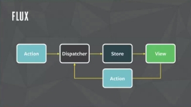
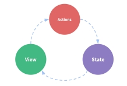
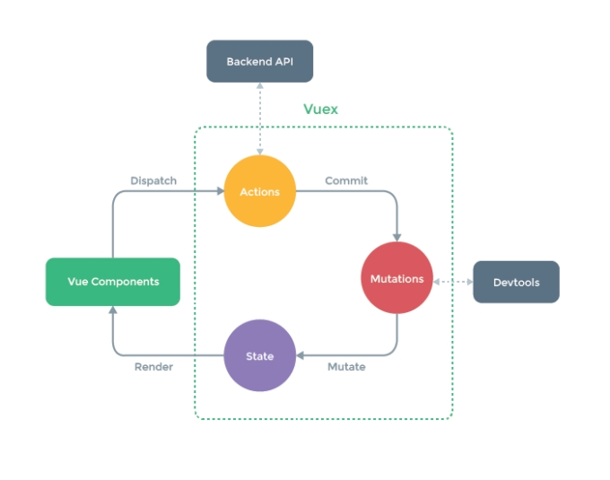
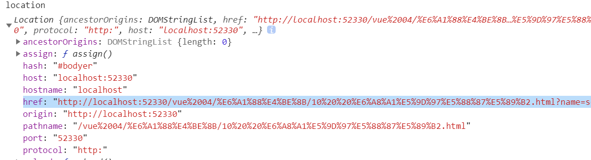
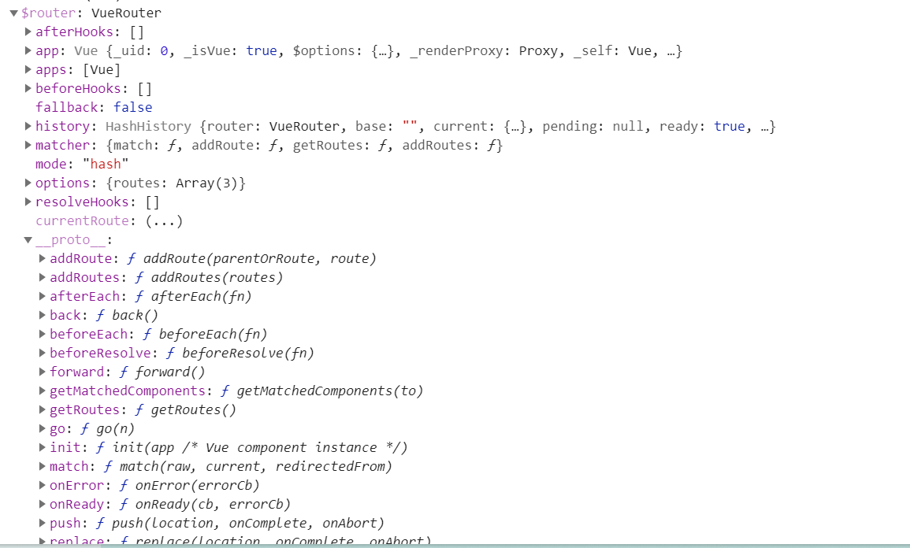
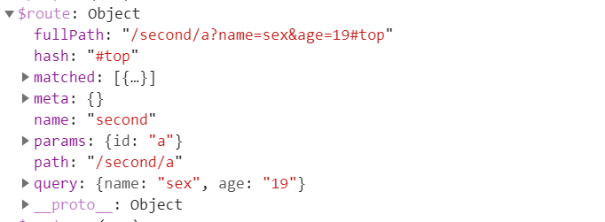

# 一、Vuex

vuex就是为了解决组件之间共享问题的。基于flux架构思想实现的。

## 1.1 flux

flux解决了组件间共享数据的问题，实现了数据单向流动。



、 

### 1.1.1组成部分

flux由四部分组成

action		表示消息对象

dispatcher 	用来捕获消息的

store 		存储数据的

view 		组件视图

### 1.1.2通信流程

一个组件发布了一个action

action被dispatcher捕获到，

dispatcher根据消息处理数据

将数据的结果传递给store，

store数据更新了，将新的数据传递给另一个的组件。

## 1.2 vuex

vuex基于flux思想实现了组件通信的框架（与观察者模式类似）

vuex也实现了单一数据源，数据单向流动的特征。

单一数据源：一个应用中，有且只有一个store对象。

数据单向流动：在整个应用中，数据始终朝着单一的方向去流动。

### 1.2.1组成部分

vuex简化了flux结构，由三部分组成：

action		表示接收消息对象，并处理数据

state			表示存储的数据

view 		表示组件视图

### 1.2.2通信流程

一个组件发布一个消息

消息被action捕获到，并根据消息类型处理数据

action将数据存储在state中，

state数据更新了，将新的数据传递给另一个组件

 


 

 

### 1.2.3 action分类

在vuex中，action分成两类

一类是同步action：	mutation

一类是异步action: 	action

### 1.2.4 store的组成

下图中绿色虚线部分就是vuex部分，我们用store表示，

我们在一个应用中，只能创建一个store。store有以下几部分组成：

state 		用来存储数据的模块

getters		用来存储计算属性数据的模块

与state的关系类似组件中的data与computed。

mutations		用来订阅同步消息的模块

同步消息用store提供的commit方法提交。

mutations相当于观察者模式中的on方法，commit相当于trigger方法。

actions		用来订阅异步消息的模块

异步消息用store提供的dispatch方法提交

actions相当于观察者模式中的on方法，dispatch相当于trigger方法、

modules		用来切割store的。

本质上是切割state数据。

注意：

如果应用中，没有异步操作，我们是可以直接发送同步消息的。

规范：

<b style="color:red;">我们只允许在同步消息中，修改state数据。其它的地方只能使用state数据。</b>



### 1.3.5安装vuex

在ES6开发中，用npm安装vuex模块

```
npm instal vuex
```

### 1.3.6使用vuex

在应用中，使用store分成五步

- 第一步 引入vuex并安装

vue家族的插件，通过Vue.use方法来安装。

只有在模块化开发中，需要安装。非模块化开发，直接使用。（cmd规范除外）。

- 第二步 创建store对象，并传递各个组成部分


state, mutations, actions, getters, modules ......

- 第三步 在vue实例化对象中，通过store属性注册store对象。


目的：就是让组件可以获取store对象。

- 第四步 在一个组件中，通过store对象发布消息。


- 第五步 在另一个组件中，通过store对象来获取state数据。


 

## 1.3同步消息

我们通过mutations定义同步消息。

是一个对象

key 		表示消息名称

value 	表示消息回调函数

第一个参数表示state数据对象

第二个参数表示接收的数据。

在函数中，用接收的数据，更新state数据。

同步消息通过commit方法提交。

第一个参数表示消息名称

第二个参数表示传递的数据

注意：数据只能在第二个参数中传递，其它的参数，无法传递数据，

如果数据有很多，我们可以将第二个参数变成一个对象或者是数组来传递多个数据。


 

## 1.4异步消息

我们通过actions定义异步消息。

是一个对象

key 		表示消息名称

value 		表示消息回调函数

第一个参数表示store对象

第二个参数表示接收的数据

在函数中，我们实现异步操作，异步操作结束，再发布同步消息。

注意：虽然可以访问store对象，但是根据规范，我们不能直接修改state数据（无法测试），必须要发布同步的消息，在同步的消息中，修改数据。

异步消息通过dispatch方法提交。

第一个参数表示消息名称

第二个参数表示提交的数据。

如果有多个数据，我们可以放在数组或者对象中。作为第二个参数传递。

## 1.5 getters

getters用来定义计算属性数据，同state的关系与组件的data与computed是一样的。

属性值是对象

key 		表示数据名称

value		计算数据的函数

第一个参数表示新的state数据

第二个参数表示新的getters数据

返回值表示获取的新的数据。

## 1.6模块切割

在store中，数据存储在state中，如果应用程序非常非常的复杂，我们都向state中存储数据，会导致属性名称覆盖的问题，为了解决这个问题，vuex提供了模块切割技术，通过modules定义

modules定义模块切割，属性值是对象

key 		表示子store的名称

value		就是子store对象。

store切割后，每一个子store也是store对象。因此也可以定义store的各个组成部分：state, getters, mutations, actions, modules ...

store中数据存储在state里面，因此对store的切割，本质上就是对state的切割，因此切割后，state数据要使用命名空间获取，

模块切割后，store的中的每一个组成部分受到的影响：

state		添加命名空间，可以正常访问。

**getters		所有getters都会添加在全局，因此getters数据不允许同名。**

mutations|actions 	用来订阅消息的，因此不受影响。

全局的消息修改全局的数据。

局部的消息修改局部的数据。

<b style="color:red;">触发了addNum， 所有的addNum都执行</b>


 

## 1.7插件

为了测试mutation，vuex提供插件：vuex/dist/logger.js

该文件提供了。测试方法，我们可以作为插件来使用。

### 1.7.1使用插件

我们在plugins配置中，来定义对store拓展的插件。

从而实现对store拓展的业务逻辑的复用。

### 1.7.2监听mutations

store提供了subscribe方法，可以监听mutations消息，无法监听action消息。

参数是一个函数

第一个表示消息对象

第二个参数表示state数据

### 1.7.3自定义插件

为了复用对store的拓展，我们可以为store定义插件，

这样在每一个项目中，通过安装插件实现对拓展业务逻辑的复用

### 1.7.4 state的代理

state的数据必须通过mutations来进行修改，如果使用了数据双向绑定，使用computed

# 二、路由

## 2.1前端路由的实现原理

完整的URL组成部分：

https://www.itbanma.cn:443/static/img/banner_news.jpg?num=100&color=red#title

### 2.1.1组成部分

协议		https://

域名		www.itbanma.cn

端口号		:443

路径		/static/img/

文件		banner_news.jpg

搜索词		?num=100&color=red

哈希		#title

前三个部分的改变会导致跨域的问题。

前六个部分的改变会导致浏览器端向服务器端发送新的请求。

只有hash的改变不会导致浏览器端向服务器端发送请求。所以前端路由的实现就是通过hash实现的。


> 路由：

```
设置多个规则，进行规则的匹配，匹配上则进入对应的页面
```

> 单页应用：

```
不刷新页面，但是可以实现根据不同的参数（路由的规则）渲染不同的内容
```


### 2.1.2前端路由实现

我们要监听hash的变化，通过window的hashchange事件监听。

当hash变化的时候，我们获取hash，根据hash的值来确定渲染的页面（组件）。

获取hash的值：location.hash获取。

> location:




## 2.2 vue路由

vue为了简化路由的使用，提供了路由插件。

在ES6开发中，通过npm来安装

```
npm install vue-router
```

### 2.2.1使用路由

使用路由分成六步：

- 第一步，引入路由并安装路由


在模块化开发中，通过Vue.use方法安装，（不包括cmd规范）

- 第二步，定义路由渲染位置。


通过router-view组件定义。

- 第三步，定义页面组件。


简化了组件的定义，只需要定义Vue.extend参数对象即可。

- 第四步，定义路由规则。


是一个数组，每个成员代表一条规则。

name 		定义路由名字

component 	定义该路由规则下，渲染的组件

path 		定义路由规则，类似express路由规则。

通过/将规则切割成多个模块，vue支持静态路由规则和动态路由规则。

静态路由规则：	一个规则对应一个路径。

例如 /home/demo

只匹配 /home/demo

不匹配 /home/list, /home, /home/demo/1

动态路由规则：	一个规则对应多个路径。(名称前面添加冒号)。

例如 /list/:page

匹配 /list/1, /list/100, /list/demo

不匹配 /list/1/2, /list, /home/2

- 第五步，创建路由实例化对象，并传递路由规则。


通过routes属性传递。

- 第六步，在vue实例化对象中，注册路由。


通过router属性注册。

 

### 2.2.2路由数据

当我们注册了路由后，所有的组件都会获取路由中的数据，并且设置了特性。

所以我们可以在模板中使用，也可以在js中使用。

$router 	表示路由实例化对象，包含一些切换路由的方法

go, back, forward, push, replace等方法



$route		路由相关数据，

如果使用的是hash路由，那么是从第一个#开始解析路由路径的。

path 		路由路径

hash 		hash数据，是第二个#后面的内容

query 		解析的query数据

params 		解析的动态路由数据

fullPath	完整路径 




### 2.2.3 props

我们在模板和js中访问路由数据太麻烦了。（每次都要通过$route访问）。

> 定义和使用

```
1、规则里面定义
2、组件里面使用
```


- 在定义路由规则的时候，我们可以设置props属性，表示传递给组件的属性数据
- 组件中，必须接收这些数据：通过props接收

props属性值有两种情况

属性值是布尔值：true

只会传递动态路由参数

属性值是方法。

参数是路由数据对象

返回值是传递给组件的属性数据。

```
1、传递数据
	a、如果将props设置为了true， 那么在组件中接收的时候，接收动态的那个设置那个name
	b、如果传递的数据为一个对象， 那么在组件中使用数组中的值对应对象中的键
	
```


### 2.2.4默认路由

我们通过path匹配*，即可定义默认路由。

此时没有匹配到规则的地址，都会匹配到默认路由。

由于默认路由匹配的非常广。所以工作中，我们常常将其定义在最后面。

### 2.2.5路由重定向

当我们输入一个地址的时候，希望进入另一个地址，可以使用路由重定向技术。

我们通过path定义匹配的地址

我们通过redirect定义重定向的地址。

bug：我们在重定向的地址中，添加了query数据，hash数据等，重定向后，路由数据对象解析数据的时候，将qurey数据，hash数据等，添加给path和params中的动态路由数据。

所以；工作中，尽量不要在重定向中添加query和hash等数据。

## 2.3子路由

在一个页面的局部，根据不同的地址，切换视图。

使用子路由分成两步

第一步	在父路由模板中，通过router-view组件，定义子路由渲染的位置。

第二步  在父路由规则中，通过children属性定义子路由规则，

每一个子路由规则仍然可以设置path, component, name, redirect, props, children...

定义路由规则的时候，

可以是相对路径

完整的路径：父路由路径+子路由路径

可以是绝对路径

完整的路径：子路由路由、

## 2.4设置滚动条

vue路由在切换页面的时候，允许我们设置滚动条位置。

我们在路由实例化对象中，通过scrollBehavior属性来监听页面的切换，并设置滚动条位置。

第一个参数表示当前路由对象

第二个参数表示上一个路由对象

第三个参数表示当前滚动条位置

返回值表示滚动条修改后的位置

x属性设置横坐标

y属性设置纵坐标

 

## 2.5路由策略

我们目前使用的是hash策略，切换hash实现对页面的切换。

vue的路由也支持path策略，切换path实现对页面的切换。

但是path的改变会导致浏览器端向服务器端发送新的请求，所以需要服务器端配合。

对请求的地址做重定向。

hash策略实现的应用是单页面应用，而path策略实现的应用是多页面应用。

我们在路由实例化对象中，设置mode属性即可实现路由策略的切换。

例如。将mode属性值设置为history，即可实现path策略。

## 2.6路由导航

我们有两种方式切换页面地址

第一种方式：通过a标签。

设置a标签的href属性

第二种方式：通过js切换。

设置location对象的属性。

我们在path策略下定义的地址，换成hash策略就失效了。

为了解决在不同策略下的兼容性问题。vue路由提供了路由导航组件：router-link。

必须设置to属性，定义地址。

注意：即使是hash策略，也不要以#开头。直接写页面地址。

默认渲染成a标签。我们可以通过tag属性，将其渲染成其它的元素。

 

## 2.7路由过渡

我们在使用路由切换页面的时候，允许添加过渡动画，用法与之前讲些的过渡是一样的。

在外部添加transition属性，

通过mode属性定义过渡类型

通过appear属性设置开场动画

...

## 2.8路由守卫

路由守卫就是指监听路由的切换动作。

监听路由切换有三种方式：

第一种 	全局路由守卫

可以监听所有页面的切换。

通过对路由实例化对象订阅beforeEach，afterEach等方法，来监听、

第一个参数表示当前路由对象

第二个参数表示上一个路由对象

如果是beforeEach将出现第三个参数，表示next方法，必须要执行。

第二种 	局部路由守卫。

可以监听当前组件的路由切换。

通过对组件实例化对象定义周期方法:beforeRouteEnter,beforeRouteLeave,beforeRouteUpdate等周期方法实现.

第一个参数表示当前路由对象

第二个参数表示上一个路由对象

第三个参数表示next方法，必须执行。

第三种 	通过watch监听器监听$route的变化。

第一个参数表示新的路由对象

第二个参数表示旧的路由对象。

这种方式只能在页面创建完成之后监听

我们可以通过创建期的方法来弥补。

一旦组件被销毁，就无法监听。

可以使用keep-alive组件，避免组件被销毁。
